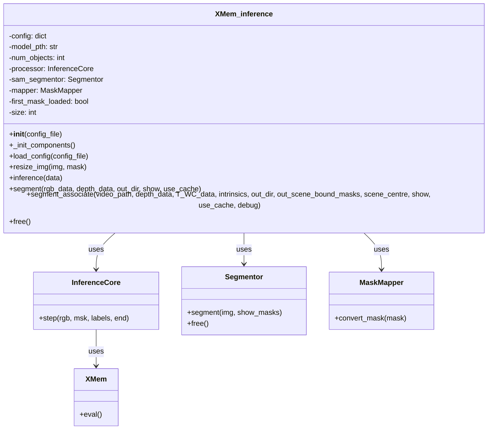

```mermaid
classDiagram
    class XMem_inference {
        -config: dict
        -model_pth: str
        -num_objects: int
        -processor: InferenceCore
        -sam_segmentor: Segmentor
        -mapper: MaskMapper
        -first_mask_loaded: bool
        -size: int
        +__init__(config_file)
        +_init_components()
        +load_config(config_file)
        +resize_img(img, mask)
        +inference(data)
        +segment(rgb_data, depth_data, out_dir, show, use_cache)
        +segment_associate(video_path, depth_data, T_WC_data, intrinsics, out_dir, out_scene_bound_masks, scene_centre, show, use_cache, debug)
        +free()
    }

    class InferenceCore {
        +step(rgb, msk, labels, end)
    }

    class Segmentor {
        +segment(img, show_masks)
        +free()
    }

    class MaskMapper {
        +convert_mask(mask)
    }

    class XMem {
        +eval()
    }

    XMem_inference --> InferenceCore : uses
    XMem_inference --> Segmentor : uses
    XMem_inference --> MaskMapper : uses
    InferenceCore --> XMem : uses
```