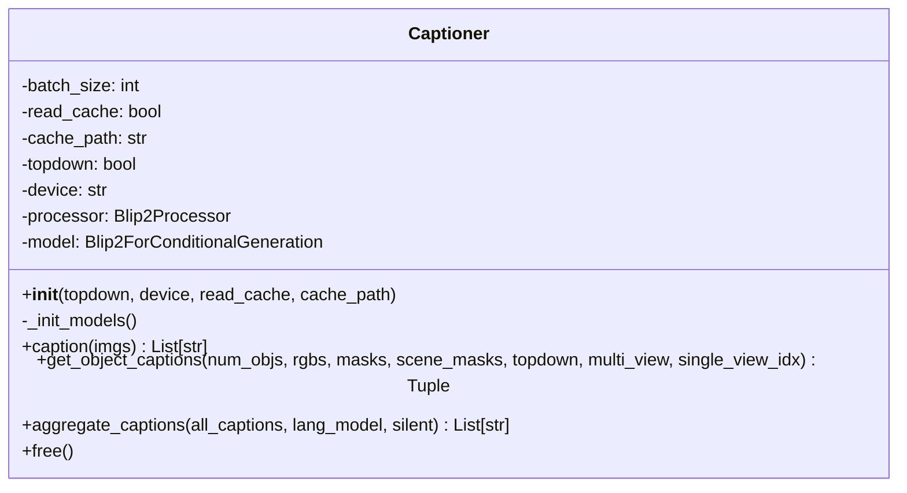

```mermaid
classDiagram
    class Captioner {
        -batch_size: int
        -read_cache: bool
        -cache_path: str
        -topdown: bool
        -device: str
        -processor: Blip2Processor
        -model: Blip2ForConditionalGeneration
        
        +__init__(topdown, device, read_cache, cache_path)
        -_init_models()
        +caption(imgs) List[str]
        +get_object_captions(num_objs, rgbs, masks, scene_masks, topdown, multi_view, single_view_idx) Tuple
        +aggregate_captions(all_captions, lang_model, silent) List[str]
        +free()
    }
```