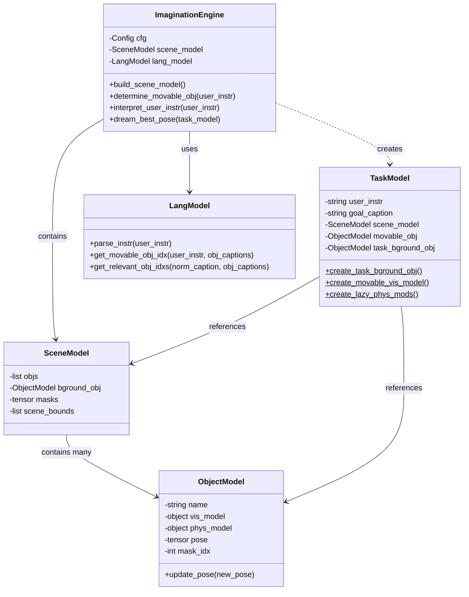

```mermaid
classDiagram
    class ImaginationEngine {
        -Config cfg
        -SceneModel scene_model
        -LangModel lang_model
        +build_scene_model()
        +determine_movable_obj(user_instr)
        +interpret_user_instr(user_instr)
        +dream_best_pose(task_model)
    }

    class ObjectModel {
        -string name
        -object vis_model
        -object phys_model
        -tensor pose
        -int mask_idx
        +update_pose(new_pose)
    }

    class SceneModel {
        -list objs
        -ObjectModel bground_obj
        -tensor masks
        -list scene_bounds
    }

    class TaskModel {
        -string user_instr
        -string goal_caption
        -SceneModel scene_model
        -ObjectModel movable_obj
        -ObjectModel task_bground_obj
        +create_task_bground_obj()$
        +create_movable_vis_model()$
        +create_lazy_phys_mods()$
    }

    class LangModel {
        +parse_instr(user_instr)
        +get_movable_obj_idx(user_instr, obj_captions)
        +get_relevant_obj_idxs(norm_caption, obj_captions)
    }

    ImaginationEngine --> SceneModel : contains
    ImaginationEngine --> LangModel : uses
    ImaginationEngine ..> TaskModel : creates
    TaskModel --> SceneModel : references
    TaskModel --> ObjectModel : references
    SceneModel --> ObjectModel : contains many
```
