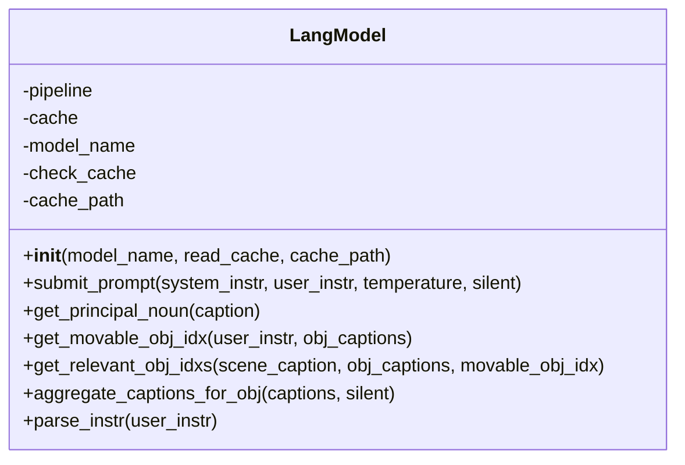

```mermaid
classDiagram
    class LangModel {
        -pipeline
        -cache
        -model_name
        -check_cache
        -cache_path
        
        +__init__(model_name, read_cache, cache_path)
        +submit_prompt(system_instr, user_instr, temperature, silent)
        +get_principal_noun(caption)
        +get_movable_obj_idx(user_instr, obj_captions)
        +get_relevant_obj_idxs(scene_caption, obj_captions, movable_obj_idx)
        +aggregate_captions_for_obj(captions, silent)
        +parse_instr(user_instr)
    }
``` 