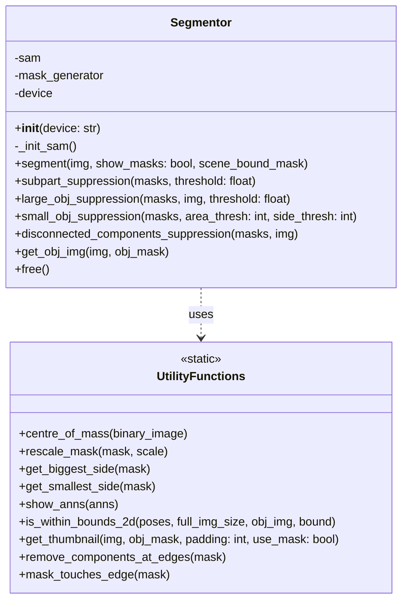

```mermaid
classDiagram
    class Segmentor {
        -sam
        -mask_generator
        -device
        +__init__(device: str)
        -_init_sam()
        +segment(img, show_masks: bool, scene_bound_mask)
        +subpart_suppression(masks, threshold: float)
        +large_obj_suppression(masks, img, threshold: float)
        +small_obj_suppression(masks, area_thresh: int, side_thresh: int)
        +disconnected_components_suppression(masks, img)
        +get_obj_img(img, obj_mask)
        +free()
    }

    class UtilityFunctions {
        <<static>>
        +centre_of_mass(binary_image)
        +rescale_mask(mask, scale)
        +get_biggest_side(mask)
        +get_smallest_side(mask)
        +show_anns(anns)
        +is_within_bounds_2d(poses, full_img_size, obj_img, bound)
        +get_thumbnail(img, obj_mask, padding: int, use_mask: bool)
        +remove_components_at_edges(mask)
        +mask_touches_edge(mask)
    }

    Segmentor ..> UtilityFunctions : uses
```