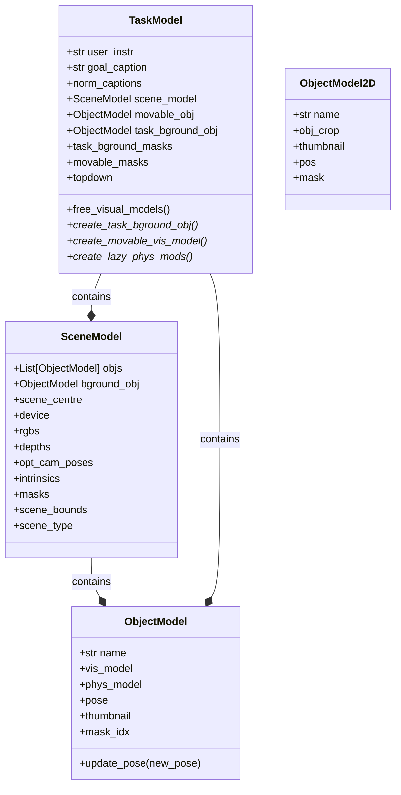

```mermaid
classDiagram
    class ObjectModel {
        +str name
        +vis_model
        +phys_model
        +pose
        +thumbnail
        +mask_idx
        +update_pose(new_pose)
    }

    class SceneModel {
        +List[ObjectModel] objs
        +ObjectModel bground_obj
        +scene_centre
        +device
        +rgbs
        +depths
        +opt_cam_poses
        +intrinsics
        +masks
        +scene_bounds
        +scene_type
    }

    class TaskModel {
        +str user_instr
        +str goal_caption
        +norm_captions
        +SceneModel scene_model
        +ObjectModel movable_obj
        +ObjectModel task_bground_obj
        +task_bground_masks
        +movable_masks
        +topdown
        +free_visual_models()
        +create_task_bground_obj()*
        +create_movable_vis_model()*
        +create_lazy_phys_mods()*
    }

    class ObjectModel2D {
        +str name
        +obj_crop
        +thumbnail
        +pos
        +mask
    }

    SceneModel --* ObjectModel : contains
    TaskModel --* SceneModel : contains
    TaskModel --* ObjectModel : contains
```