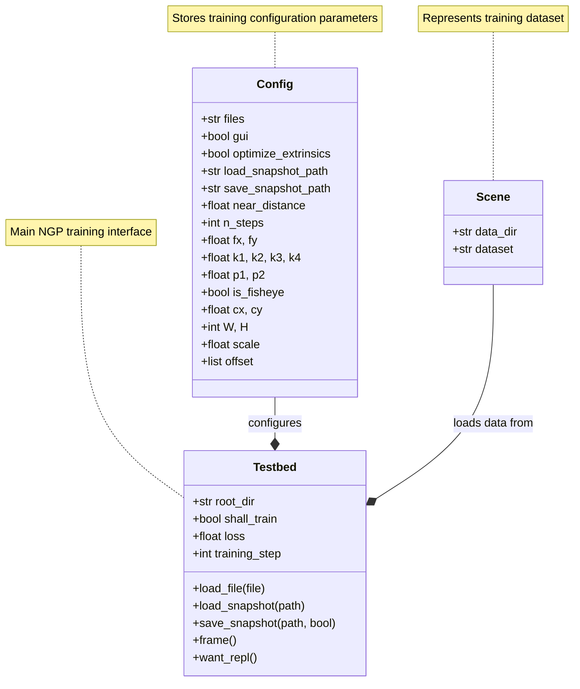

```mermaid
classDiagram
    class Config {
        +str files
        +bool gui
        +bool optimize_extrinsics
        +str load_snapshot_path
        +str save_snapshot_path
        +float near_distance
        +int n_steps
        +float fx, fy
        +float k1, k2, k3, k4
        +float p1, p2
        +bool is_fisheye
        +float cx, cy
        +int W, H
        +float scale
        +list offset
    }

    class Testbed {
        +str root_dir
        +bool shall_train
        +float loss
        +int training_step
        +load_file(file)
        +load_snapshot(path)
        +save_snapshot(path, bool)
        +frame()
        +want_repl()
    }

    class Scene {
        +str data_dir
        +str dataset
    }

    Config --* Testbed : configures
    Scene --* Testbed : loads data from

    note for Config "Stores training configuration parameters"
    note for Testbed "Main NGP training interface"
    note for Scene "Represents training dataset"
```