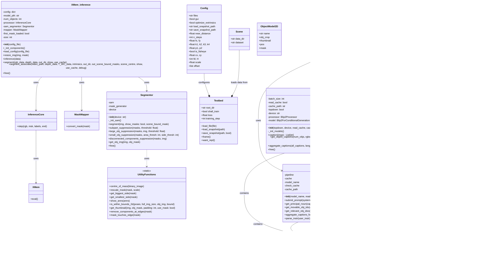

```mermaid
classDiagram
    %% XMem_infer components
    class XMem_inference {
        -config: dict
        -model_pth: str
        -num_objects: int
        -processor: InferenceCore
        -sam_segmentor: Segmentor
        -mapper: MaskMapper
        -first_mask_loaded: bool
        -size: int
        +__init__(config_file)
        +_init_components()
        +load_config(config_file)
        +resize_img(img, mask)
        +inference(data)
        +segment(rgb_data, depth_data, out_dir, show, use_cache)
        +segment_associate(video_path, depth_data, T_WC_data, intrinsics, out_dir, out_scene_bound_masks, scene_centre, show, use_cache, debug)
        +free()
    }

    class InferenceCore {
        +step(rgb, msk, labels, end)
    }

    class MaskMapper {
        +convert_mask(mask)
    }

    class XMem {
        +eval()
    }

    %% Segmentor from sam_seg.md
    class Segmentor {
        -sam
        -mask_generator
        -device
        +__init__(device: str)
        -_init_sam()
        +segment(img, show_masks: bool, scene_bound_mask)
        +subpart_suppression(masks, threshold: float)
        +large_obj_suppression(masks, img, threshold: float)
        +small_obj_suppression(masks, area_thresh: int, side_thresh: int)
        +disconnected_components_suppression(masks, img)
        +get_obj_img(img, obj_mask)
        +free()
    }

    class UtilityFunctions {
        <<static>>
        +centre_of_mass(binary_image)
        +rescale_mask(mask, scale)
        +get_biggest_side(mask)
        +get_smallest_side(mask)
        +show_anns(anns)
        +is_within_bounds_2d(poses, full_img_size, obj_img, bound)
        +get_thumbnail(img, obj_mask, padding: int, use_mask: bool)
        +remove_components_at_edges(mask)
        +mask_touches_edge(mask)
    }

    %% Train_ngp components
    class Config {
        +str files
        +bool gui
        +bool optimize_extrinsics
        +str load_snapshot_path
        +str save_snapshot_path
        +float near_distance
        +int n_steps
        +float fx, fy
        +float k1, k2, k3, k4
        +float p1, p2
        +bool is_fisheye
        +float cx, cy
        +int W, H
        +float scale
        +list offset
    }

    class Testbed {
        +str root_dir
        +bool shall_train
        +float loss
        +int training_step
        +load_file(file)
        +load_snapshot(path)
        +save_snapshot(path, bool)
        +frame()
        +want_repl()
    }

    class Scene {
        +str data_dir
        +str dataset
    }

    %% Object and Scene Models
    class ObjectModel {
        +str name
        +vis_model
        +phys_model
        +pose
        +thumbnail
        +mask_idx
        +update_pose(new_pose)
    }

    class ObjectModel2D {
        +str name
        +obj_crop
        +thumbnail
        +pos
        +mask
    }

    class SceneModel {
        +List[ObjectModel] objs
        +ObjectModel bground_obj
        +scene_centre
        +device
        +rgbs
        +depths
        +opt_cam_poses
        +intrinsics
        +masks
        +scene_bounds
        +scene_type
    }

    class TaskModel {
        +str user_instr
        +str goal_caption
        +norm_captions
        +SceneModel scene_model
        +ObjectModel movable_obj
        +ObjectModel task_bground_obj
        +task_bground_masks
        +movable_masks
        +topdown
        +free_visual_models()
        +create_task_bground_obj()*
        +create_movable_vis_model()*
        +create_lazy_phys_mods()*
    }

    %% Language Model
    class LangModel {
        -pipeline
        -cache
        -model_name
        -check_cache
        -cache_path
        +__init__(model_name, read_cache, cache_path)
        +submit_prompt(system_instr, user_instr, temperature, silent)
        +get_principal_noun(caption)
        +get_movable_obj_idx(user_instr, obj_captions)
        +get_relevant_obj_idxs(scene_caption, obj_captions, movable_obj_idx)
        +aggregate_captions_for_obj(captions, silent)
        +parse_instr(user_instr)
    }

    %% Captioner
    class Captioner {
        -batch_size: int
        -read_cache: bool
        -cache_path: str
        -topdown: bool
        -device: str
        -processor: Blip2Processor
        -model: Blip2ForConditionalGeneration
        +__init__(topdown, device, read_cache, cache_path)
        -_init_models()
        +caption(imgs) List[str]
        +get_object_captions(num_objs, rgbs, masks, scene_masks, topdown, multi_view, single_view_idx) Tuple
        +aggregate_captions(all_captions, lang_model, silent) List[str]
        +free()
    }

    %% ImaginationEngine
    class ImaginationEngine {
        -Config cfg
        -SceneModel scene_model
        -LangModel lang_model
        +build_scene_model()
        +determine_movable_obj(user_instr)
        +interpret_user_instr(user_instr)
        +dream_best_pose(task_model)
    }

    %% Relationships
    XMem_inference --> InferenceCore : uses
    XMem_inference --> Segmentor : uses
    XMem_inference --> MaskMapper : uses
    InferenceCore --> XMem : uses
    Segmentor ..> UtilityFunctions : uses
    Config --* Testbed : configures
    Scene --* Testbed : loads data from
    SceneModel --* ObjectModel : contains
    TaskModel --* SceneModel : contains
    TaskModel --* ObjectModel : contains
    ImaginationEngine --> SceneModel : contains
    ImaginationEngine --> LangModel : uses
    ImaginationEngine ..> TaskModel : creates
    Captioner --> LangModel : uses for aggregation
    TaskModel --> SceneModel : references
    TaskModel --> ObjectModel : references
    SceneModel --> ObjectModel : contains many
    ImaginationEngine --> Captioner : likely uses
    TaskModel --> LangModel : likely uses
```