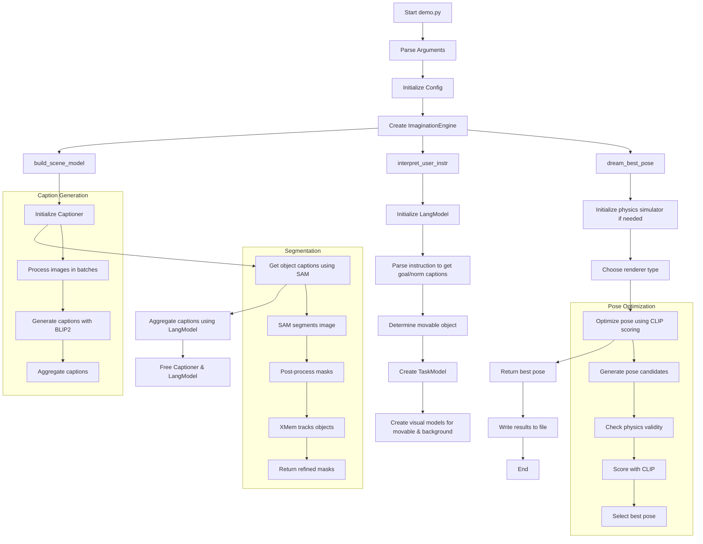

```mermaid
flowchart TD
    A[Start demo.py] --> B[Parse Arguments]
    B --> C[Initialize Config]
    C --> D[Create ImaginationEngine]
    
    D --> E[build_scene_model]
    E --> E1[Initialize Captioner]
    E1 --> E2[Get object captions using SAM]
    E2 --> E3[Aggregate captions using LangModel]
    E3 --> E4[Free Captioner & LangModel]
    
    D --> F[interpret_user_instr]
    F --> F1[Initialize LangModel]
    F1 --> F2[Parse instruction to get goal/norm captions]
    F2 --> F3[Determine movable object]
    F3 --> F4[Create TaskModel]
    F4 --> F5[Create visual models for movable & background]
    
    D --> G[dream_best_pose] 
    G --> G1[Initialize physics simulator if needed]
    G1 --> G2[Choose renderer type]
    G2 --> G3[Optimize pose using CLIP scoring]
    G3 --> G4[Return best pose]
    
    G4 --> H[Write results to file]
    H --> I[End]

    subgraph Segmentation
        E2 --> SAM1[SAM segments image]
        SAM1 --> SAM2[Post-process masks]
        SAM2 --> SAM3[XMem tracks objects]
        SAM3 --> SAM4[Return refined masks]
    end

    subgraph Caption Generation
        E1 --> CAP1[Process images in batches]
        CAP1 --> CAP2[Generate captions with BLIP2]
        CAP2 --> CAP3[Aggregate captions]
    end

    subgraph Pose Optimization
        G3 --> PO1[Generate pose candidates]
        PO1 --> PO2[Check physics validity]
        PO2 --> PO3[Score with CLIP]
        PO3 --> PO4[Select best pose]
    end
```